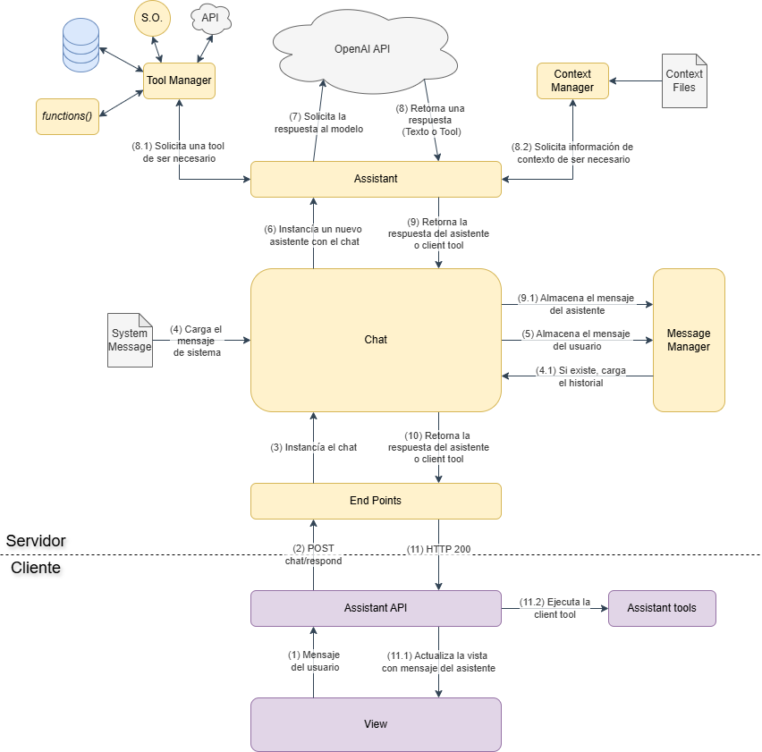
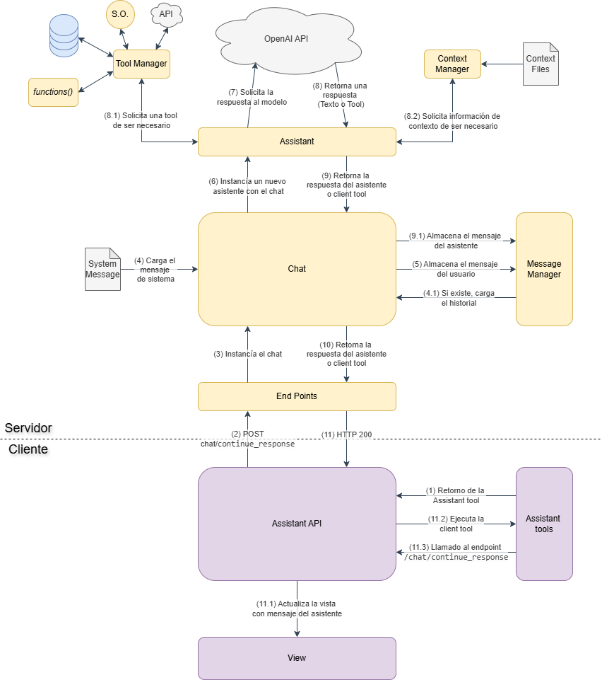

# Documentación de la API

## Endpoints

### `/chat/respond`

**Método:** `POST`

**Descripción:** Procesa un mensaje del usuario y genera una respuesta del asistente. De ser necesario, retorna las herramientas (`tools`) necesarias para ejecutar funciones en el cliente. En estas situaciones, la respuesta debe ser continuada con el endpoint `/chat/continue_response`.

> **Nota:** En este endpoint, solo puede haber un objeto `message` o `tools`, nunca ambos simultáneamente. El cliente debe validar cuál de los dos está presente en la respuesta.

[](img/endpoint_respond.png)


**Request:**
```json
{
  "user": "string",
  "message": "string",
  "have_tools": "boolean (opcional)",
  "conversation_file": "string (opcional)",
  "timestamp": "string (opcional)"
}
```

**Response:**
```json
{
  "header": {
    "id": "string",
    "user": "string",
    "title": "string",
    "timestamp": "string",
    "last_modified": "string",
    "filename": "string"
  },
  "message": {
    "role": "string",
    "content": "string",
    "timestamp": "string",
    "id": "string"
  },
  "tools": [
    {
      "id": "string",
      "type": "string",
      "function": {
        "name": "string",
        "arguments": "string"
      }
    }
  ]
}
```

**Errores:**
- `400`: Formato de archivo de conversación o timestamp inválido.
- `404`: Archivo de conversación no encontrado.
- `500`: Error del servidor.

### `/chat/continue_response`

**Método:** `POST`

**Descripción:** Permite al asistente continuar procesando una respuesta anterior cuando se solicitó la ejecución de herramientas. Este endpoint también puede generar la solicitud de más herramientas en caso de ser necesario.

> **Nota:** En este endpoint, solo puede haber un objeto `message` o `tools`, nunca ambos simultáneamente. El cliente debe validar cuál de los dos está presente en la respuesta.

[](img/endpoint_continue.png)


**Request:**
```json
{
  "user": "string (opcional)",
  "have_tools": "boolean (opcional)",
  "conversation_file": "string (opcional)",
  "tools": [
    {
      "id": "string",
      "type": "string",
      "function": {
        "name": "string",
        "arguments": "string"
      }
    }
  ],
  "calls": [
    {
      "role": "string",
      "content": "string",
      "tool_call_id": "string"
    }
  ]
}
```

**Response:**
```json
{
  "header": {
    "id": "string",
    "user": "string",
    "title": "string",
    "timestamp": "string",
    "last_modified": "string",
    "filename": "string"
  },
  "message": {
    "role": "string",
    "content": "string",
    "timestamp": "string",
    "id": "string"
  },
  "tools": [
    {
      "id": "string",
      "type": "string",
      "function": {
        "name": "string",
        "arguments": "string"
      }
    }
  ]
}
```

**Errores:**
- `400`: Formato de archivo de conversación inválido.
- `404`: Archivo de conversación no encontrado.
- `500`: Error del servidor.

### `/chat/set_title`

**Método:** `POST`

**Descripción:** Permite a los usuarios cambiar el título de la conversación.

**Request:**
```json
{
  "user": "string",
  "new_title": "string",
  "conversation_file": "string"
}
```

**Response:**
```json
{
  "detail": "string",
  "header": {
    "id": "string",
    "user": "string",
    "title": "string",
    "timestamp": "string",
    "last_modified": "string",
    "filename": "string"
  }
}
```

**Errores:**
- `400`: Archivo de conversación requerido.
- `404`: Archivo de conversación no encontrado.
- `500`: Error del servidor.

### `/chat/last_message`

**Método:** `GET`

**Descripción:** Recupera el último mensaje de una conversación.

**Request:**
```json
{
  "user": "string",
  "conversation_file": "string"
}
```

**Response:**
```json
{
  "message": {
    "role": "string",
    "content": "string",
    "timestamp": "string",
    "id": "string"
  }
}
```

**Errores:**
- `400`: Archivo de conversación o usuario requerido.
- `404`: Archivo de conversación no encontrado.
- `500`: Error del servidor.

### `/chat/messages`

**Método:** `GET`

**Descripción:** Recupera todos los mensajes de una conversación.

**Request:**
```json
{
  "user": "string",
  "conversation_file": "string"
}
```

**Response:**
```json
{
  "messages": [
    {
      "role": "string",
      "content": "string",
      "timestamp": "string",
      "id": "string"
    }
  ]
}
```

**Errores:**
- `400`: Archivo de conversación o usuario requerido.
- `404`: Archivo de conversación no encontrado.
- `500`: Error del servidor.

### `/chat/conversation`

**Método:** `GET`

**Descripción:** Recupera el objeto completo de la conversación.

**Request:**
```json
{
  "user": "string",
  "conversation_file": "string"
}
```

**Response:**
```json
{
  "conversation": {
    "header": {
      "id": "string",
      "user": "string",
      "title": "string",
      "timestamp": "string",
      "last_modified": "string",
      "filename": "string"
    },
    "messages": [
      {
        "role": "string",
        "content": "string",
        "timestamp": "string",
        "id": "string"
      }
    ]
  }
}
```

**Errores:**
- `400`: Archivo de conversación o usuario requerido.
- `404`: Archivo de conversación no encontrado.
- `500`: Error del servidor.

### `/chat/headers`

**Método:** `GET`

**Descripción:** Recupera los encabezados de todas las conversaciones de un usuario.

**Request:**
```json
{
  "user": "string"
}
```

**Response:**
```json
{
  "headers": [
    {
      "id": "string",
      "user": "string",
      "title": "string",
      "timestamp": "string",
      "last_modified": "string",
      "filename": "string"
    }
  ]
}
```

**Errores:**
- `400`: Usuario requerido.
- `404`: Archivo de conversación no encontrado.
- `500`: Error del servidor.

### `/chat/delete`

**Método:** `DELETE`

**Descripción:** Elimina una conversación específica de un usuario.

**Request:**
```json
{
  "user": "string",
  "conversation_file": "string"
}
```

**Response:**
```json
{
  "detail": "string"
}
```

**Errores:**
- `400`: Archivo de conversación o usuario requerido.
- `404`: Archivo de conversación no encontrado.
- `500`: Error del servidor.
